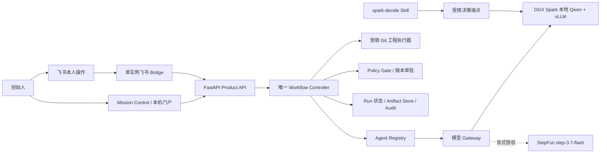

# Co-founder OS

> 在 NVIDIA DGX Spark 上运行本地大模型，把 AI 工程任务变成“真实执行、可核对、可恢复、由本人批准”的交付闭环。

[](https://www.python.org/)
[](https://fastapi.tiangolo.com/)
[](LICENSE)

Co-founder OS 面向个人创业者和小型团队。它不是让多个 Agent 在聊天窗口里轮流给建议，而是为每次任务建立可追踪的 Run、Task、版本、预算、补丁、测试、复核、审批和导出记录。当前黑客松主案例是一个边界明确的软件工程任务：为合成保险 POC 增加材料完整性检查并补齐测试。系统让实施 Agent 在受限 Git 工作区生成真实补丁，执行真实检查，由同一 Qwen 的独立上下文完成复核；反馈产生新 revision，旧批准不能沿用，只有本人批准的当前版本才允许导出。

## 目录

- [一、项目说明文档](#一项目说明文档)
- [二、系统架构](#二系统架构)
- [三、部署说明](#三部署说明)
- [四、大模型优化](#四大模型优化)
- [五、Agent Skills 设计](#五agent-skills-设计)
- [六、技术栈说明](#六技术栈说明)
- [七、快速运行与验证](#七快速运行与验证)
- [八、真实结果与限制](#八真实结果与限制)

---

## 一、项目说明文档

### 1.1 创作背景与作品特点

个人创业者使用 AI 编程时，最大的风险通常不是“模型不会写代码”，而是无法确认一次交付究竟发生了什么：代码是否真正写入工作区，测试是否真的执行，Reviewer 审查的是不是当前补丁，手机上批准的版本是否与最终导出一致，连接中断后恢复的还是不是同一个任务。聊天中的一句“完成了”经常把计划、执行、验证和批准混为一谈。Co-founder OS 针对这个问题，把 AI 协作从回答生成改造成一条有状态、有证据、有权限边界的工程流水线。

作品的第一个特点是**真实执行，而不是计划展示**。实施 Agent 获得受限任务契约、固定基线和允许修改的路径，在隔离 Git 工作区生成文件与补丁；系统实际运行契约测试、生成测试和相关回归，并保存命令、退出码、补丁哈希与候选提交。失败会进入明确状态，不会因为模型输出了“测试通过”就进入审批阶段。

第二个特点是**版本绑定的人机治理**。系统由唯一 Workflow Controller 管理权威状态。Web 界面、飞书、模型和 Skill 都不能直接宣布任务获批。每次批准必须绑定 Run、Task、revision、base、patch、Approval ID 和有效期；发生反馈后生成新 revision，旧测试、旧复核和旧批准不能自动继承。用户可以在电脑端查看定位证据，在飞书完成本人批准或驳回，最终导出只允许读取已经批准的准确版本。

第三个特点是**本地优先与权限约束**。主模型部署在 NVIDIA DGX Spark，敏感任务可以保持本地推理。可选的 StepFun 云端通道只有在隐私等级、允许 provider、显式云调用授权和持久预算同时满足时才可使用；本地调用失败不会偷偷扩大权限。模型负责建议和生成，确定性策略负责身份、预算、隐私、路径、版本与审批门禁。

第四个特点是**失败可见、恢复可查**。消息去重、任务 claim、有限重试、候选保护、审计事件和恢复回执都被持久化。真实演练保留了复核引用错误、批准过期、网络断开等失败，没有把不同 Run 的最佳片段拼成一条“完美演示”。WebSocket 重连验证保持了同一进程和同一 Run；平台接受附件只记录为发送回执，不被写成用户已经阅读。

第五个特点是**独立而克制的 Agent Skill**。仓库内的 [`spark-decide`](skills/spark-decide/SKILL.md) 可以脱离主项目目录使用，只在调用者提供的有限候选中建议 `local`、`step`、`human` 或 `refuse`。它不执行下游动作、不授予云端权限、不代替本人批准。Skill 的 schema、标准库客户端、示例和失败语义均独立保存，适合被其他 Agent 或自动化流程复用。

### 1.2 核心亮点

- **同一 Run 的工程闭环**：需求、候选、测试、复核、反馈、批准和附件导出不跨 Run 拼接。
- **真实 Git 产物**：生成可检查的 diff 和候选提交，而不是只输出实现建议。
- **同模型独立上下文复核**：实施和 Reviewer 使用相同 Qwen、不同上下文；明确不冒充多模型共识。
- **版本失效机制**：反馈形成新 revision 后，旧证据与旧批准不能推进新版本。
- **本人批准**：Agent、Skill、Web 批注和飞书消息都不能替代用户本人决策。
- **本地模型与受控云通道**：本地 Qwen 为生产主线，StepFun 仅为获准候选 provider。
- **证据化发布**：源码清单、静态扫描、依赖审计、签名 manifest 与篡改负测共同约束发布包。
- **诚实实验边界**：学习路由保持 shadow；NVIDIA Dynamo、Nemotron 与 Lavish 只按实际实验结果说明。

### 1.3 技术实现方案与优化思路

后端使用 FastAPI 和 Pydantic 定义严格契约。Run、Task、Artifact、Approval、路由结果和审计事件都有版本化模型；文件状态通过结构化 JSON、追加式 JSONL 和 SHA-256 Artifact Store 保存。Workflow Controller 负责生命周期，Agent Registry 负责能力匹配，Gateway 统一封装本地 Qwen 和获准的 StepFun 接口。工程执行器把模型建议限制在可信 Git 基线、白名单路径、有限尝试数和测试容器中；Reviewer 只能根据当前补丁和证据给出结构化结果。

系统优化优先选择“减少不确定性”，而不是盲目增加 Agent 数量。主流程使用一个本地 Qwen 服务，实施和复核串行执行以避免争抢 GPU；长篇说明不会重复塞入每次推理，独立 Skill 使用短 JSON 契约；预算在调用前预留，在失败、重试和回退时仍受同一持久约束。学习路由只在 shadow 中记录，不改变真实动作。用户界面使用轻量 HTML/CSS/JavaScript，由 FastAPI 同源提供，减少额外前端运行时和跨域状态分叉。

---

## 二、系统架构



关键设计原则：

1. **单一状态权威**：只有 Workflow Controller 可以改变 Run/Task 的权威状态。
2. **模型不拥有权限**：模型输出不能绕过 provider、隐私、预算、路径或审批门禁。
3. **证据绑定版本**：补丁、测试、复核、反馈、批准和导出都绑定准确 revision。
4. **本地优先、云端显式授权**：受限数据不会因重试或回退自动流向云端。
5. **失败不抹除**：历史失败、过期批准和未运行实验属于最终结果的一部分。

---

## 三、部署说明

### 3.1 本地算力部署拓扑

实际部署使用 NVIDIA DGX Spark / GB10（Linux ARM64）作为推理与产品服务节点：

```text
Mac 浏览器 / 飞书客户端
        │
        ├─ 可选 SSH 隧道 / 受限本机门户：127.0.0.1:19000
        │
        ▼
DGX Spark
  ├─ Qwen3.5-35B-A3B-FP8 + vLLM：127.0.0.1:8000
  ├─ Co-founder OS Gateway / Product API：127.0.0.1:9000
  ├─ 唯一飞书 Bridge
  ├─ Git 工程工作区与测试运行器
  └─ Run 状态、审计与制品存储
```

生产主模型固定为 `Qwen3.5-35B-A3B-FP8`，使用固定 ModelScope revision 和 14 个已核验权重分片。实际引擎为 vLLM `0.18.1rc1.dev220+g5b8c30d62`、PyTorch `2.10.0+cu130`。部署复用只读权重和不可变镜像标识；新节点必须核对模型 revision、分片数量、大小和 SHA-256，不能使用滚动 nightly tag 冒充同一版本。

### 3.2 应用安装

```bash
git clone https://github.com/JimChen-g/cofounder-os.git
cd cofounder-os

python3 -m venv .venv
source .venv/bin/activate
python -m pip install --upgrade pip setuptools wheel
python -m pip install -e ".[dev]"

cp .env.example .env
# 只在本机填写真实配置；禁止提交 .env 或令牌

bash scripts/run_gateway.sh
```

默认入口：

- Mission Control：`http://127.0.0.1:9000/ui`
- Gateway 健康：`http://127.0.0.1:9000/health`
- Product API 健康：`http://127.0.0.1:9000/api/health`
- OpenAPI：`http://127.0.0.1:9000/docs`

常用配置：

| 配置 | 作用 |
|---|---|
| `QWEN_BASE_URL` | 本地 vLLM 的 OpenAI 兼容 `/v1` 地址 |
| `QWEN_MODEL` | 固定的 Qwen 服务模型 ID |
| `QWEN_API_KEY` | 本地模型服务凭据；不得写入仓库 |
| `STEP_BASE_URL` | `https://api.stepfun.com/step_plan/v1` |
| `STEP_MODEL` | `step-3.7-flash` |
| `STEP_API_KEY` | StepFun 凭据；只有显式授权时使用 |
| `GATEWAY_ALLOW_CLOUD` | 是否允许云端 provider 候选 |
| `PRODUCT_DATA_DIR` | Run、Task、制品和审计状态目录 |
| `GATEWAY_AUDIT_TOKEN` | 审计读取令牌；未配置时端点关闭 |

### 3.3 DGX Spark 发布与回滚

Mac Git 仓库是源码权威，Spark 是部署目标。发布脚本要求本机 `main` 和远端源码区干净，通过经过校验的 Git Bundle/传输包同步固定提交；远端 `data/`、日志、模型权重、`.env`、服务配置和审批记录不由源码部署覆盖。

```bash
# 只验证，不部署
scripts/deploy-to-spark.sh --dry-run

# 部署当前干净 main；失败时自动恢复前一提交
scripts/deploy-to-spark.sh

# 产品健康与远端/隧道冒烟
scripts/smoke-product.sh

# 回滚到上一版或指定提交
scripts/rollback-product.sh [commit-sha]
```

发布后必须分别核对源码提交、模型服务身份、Product API 健康、唯一 Bridge、受保护 Run 与候选对象；不同层可以有不同版本标识，不能只凭一个 SHA 推断整个系统完全一致。

---

## 四、大模型优化

本项目没有用未经验证的“性能倍数”描述优化，而是围绕本地资源、可恢复性和输出可靠性实施以下措施：

1. **FP8 权重与固定运行镜像**：生产使用 Qwen3.5-35B-A3B-FP8，降低权重占用；权重 revision、14 个分片和镜像 ID 均固定核验。
2. **DGX Spark 统一内存调度**：实际节点统一内存约 124614 MiB；模型加载日志约 34.23 GiB。设置 GPU 内存比例和并发上限，并与其他 GPU 作业错峰。
3. **受控 vLLM 配置**：上下文 8192、TP=1、并发 2、batch 2048、GPU 内存比例 0.55、thinking 关闭、prefix cache 开启；这些是本项目锁定配置，不推广为所有任务的最优值。
4. **短契约与结构化输出**：工程任务、Reviewer 和 Skill 均使用有限 schema；失败时进行有上限的格式修复，不无限追加上下文。
5. **串行真实推理**：实施、复核和决定请求在共享 GPU 上按阶段串行，避免为演示同时部署多个生产 Bridge 或争抢模型。
6. **规则路由 + learning shadow**：24 个合成实例按 12/6/6 冻结训练、校准、留出；校准未达到启用阈值，因此学习结果只观察、不改变生产动作。
7. **权限优先的 provider 过滤**：隐私、provider grant、预算和用户授权先于模型选择；失败不会自动升级到云端。
8. **实验与生产隔离**：Dynamo、Nemotron 的实验运行时结束后清理，不替换稳定 Qwen 服务，也不把共驻冒烟解释为生产优化。

---

## 五、Agent Skills 设计

本项目提交的 Skill Markdown 位于：

**[`skills/spark-decide/SKILL.md`](skills/spark-decide/SKILL.md)**

配套文件：

```text
skills/spark-decide/
├── SKILL.md
├── scripts/
│   ├── decide.py
│   └── demo.py
├── references/
│   ├── request.schema.json
│   └── response.schema.json
└── examples.json
```

### 5.1 设计目标

`spark-decide` 解决的是一个窄问题：在调用者提供的有限动作中，结合隐私、provider 权限、调用授权和预算，给出一个短路由建议。合法动作是 `local`、`step`、`human`、`refuse`。服务器先确定合法候选，再最多进行一次本地模型推理。

Skill 的核心安全边界：

- 推荐动作不等于执行动作；
- 推荐 `step` 不会自动调用 StepFun；
- 推荐 `human` 不代表人已经批准；
- 使用 decision-only bearer token，不能访问聊天或产品 API；
- 本地失败不自动重试，也不回退云端；
- `scores: null` / `score_kind: unavailable` 不解释为零置信度；
- request/output hash 用于追踪，不是签名或批准凭据。

### 5.2 项目外调用

```bash
export SPARK_DECIDE_URL="http://127.0.0.1:9000/v1/spark-decide"
export SPARK_DECIDE_API_KEY="<decision-only-token>"

python /path/to/spark-decide/scripts/decide.py /path/to/request.json
```

最小接线测试：

```bash
python skills/spark-decide/scripts/demo.py
```

`demo.py` 使用明确标记的本地 fixture，模型调用为 0；它验证客户端接线，不是实时 Qwen 或决策质量证据。

---

## 六、技术栈说明

### 6.1 NVIDIA 软件、SDK 与硬件

| 组件 | 本项目用途 | 采用状态 |
|---|---|---|
| NVIDIA DGX Spark / GB10 | 本地大模型推理、产品 API、工程测试与 Bridge 运行节点 | 生产主线 |
| NVIDIA Driver 580.126.09 / CUDA 13.0 驱动能力 | 为 ARM64 GPU 容器和 PyTorch/vLLM 提供运行基础；CUDA 13.0 为 `nvidia-smi` 驱动报告 | 生产主线 |
| NVIDIA Container Toolkit / Docker GPU Runtime | 隔离模型与工程测试运行环境，限制资源和挂载范围 | 生产部署基础 |
| NVIDIA NGC | 获取并固定 NVIDIA Dynamo 实验运行时 | 隔离实验 |
| NVIDIA Dynamo 1.5.0 | 单 worker 真实生成链路与部署可行性验证 | 实验，未替换生产 vLLM |
| NIXL 1.3.2 | Nemotron NVFP4 实验运行时组件 | 实验 |

注意：日志中的 PyTorch “Dynamo bytecode transform” 不等于 NVIDIA Dynamo 分布式推理框架已在生产启用。

### 6.2 模型与推理引擎

| 模型/引擎 | 作用 | 状态与边界 |
|---|---|---|
| `Qwen3.5-35B-A3B-FP8` | 工程实施、独立上下文复核和本地短决定的主模型 | 生产主线；ModelScope 固定 revision，14 个权重分片核验 |
| vLLM `0.18.1rc1.dev220+g5b8c30d62` | Qwen 的 OpenAI 兼容本地推理服务 | 生产主线 |
| PyTorch `2.10.0+cu130` | 本地模型运行基础 | 生产主线 |
| StepFun `step-3.7-flash` | 经 Gateway 管理的可选云端 provider / 受控回退 | 已做真实连接与冒烟；非固定主案例必经 |
| `NVIDIA-Nemotron-3.5-Lightning-30B-A3B-NVFP4` | 中文、JSON、代码三个短请求与 NVFP4 加载实验 | 实验；未完成与 Qwen 的共同任务比较，未生产采用 |
| vLLM `0.28.0` / PyTorch `2.13.0+cu130` | Nemotron 实验运行时 | 实验，不与生产版本混写 |

### 6.3 应用与工程栈

| 层 | 技术 |
|---|---|
| API 与运行时 | Python 3.10+、FastAPI、Uvicorn |
| 数据契约 | Pydantic 2、pydantic-settings、JSON Schema |
| 模型访问 | httpx、OpenAI-compatible Chat Completions |
| 可靠性 | Tenacity、显式状态机、claim token、有限重试与恢复 |
| 状态与制品 | JSON、JSONL、SQLite inbox/ledger、文件 Artifact Store、SHA-256 |
| 工程执行 | Git 隔离工作区、固定 base、可信测试镜像、版本绑定候选 |
| 前端 | HTML、CSS、原生 JavaScript，由 FastAPI 同源提供 |
| 移动入口 | 飞书开放平台 SDK / WSS 单实例 Bridge |
| 质量门禁 | pytest、pytest-asyncio、Ruff、Mypy、Node syntax check、Python build |
| 安全与发布 | Bandit、Semgrep、Gitleaks、依赖审计、RSA-3072 签名 manifest |

---

## 七、快速运行与验证

### 7.1 CPU 与离线检查

```bash
source .venv/bin/activate

pytest
ruff check app tests
mypy app
python scripts/build_insurance_poc_fixtures.py --verify-only
python skills/spark-decide/scripts/demo.py
```

### 7.2 合成保险演示

```bash
PRODUCT_DATA_DIR=/tmp/cofounder-os-insurance-demo/data \
GATEWAY_PORT=9100 \
bash scripts/run_gateway.sh
```

打开 `http://127.0.0.1:9100/ui`，加载稳定演示并启动任务。预期受控停止点是 `waiting_approval`；只有当前版本的本人批准或驳回才能继续。该演示使用合成 PDF 和图片，不提供保险责任、赔付或法律结论。

更多契约与实现文档：

- [架构契约](docs/architecture-contract.md)
- [领域模型](docs/domain-model.md)
- [Workflow Controller](docs/workflow-controller.md)
- [工程闭环说明](docs/t23-t27.md)
- [Skill 配对评测与限制](docs/t28-t29.md)
- [独立审查修复记录](docs/independent-review-fixes.md)
- [部署流程](docs/deployment-workflow.md)

---

## 八、真实结果与限制

### 已验证

- 连续三次真实工程闭环完成：实际候选、三项检查、独立上下文复核、本人飞书批准、导出和附件交付。
- 其中一轮覆盖 Web 函数说明批注、revision 2、重新检查、重新复核与版本绑定批准。
- 发布源码在干净 Git clone 和独立 Python 3.10 环境完成 782 项测试。
- 仓库 Skill 与带 LICENSE 的独立 Skill 均通过 12/12 Tier 1 结构验证。
- 最终扫描保留 Bandit 43 低/5 中/0 高、Semgrep 0 发现但 1 处部分解析、Gitleaks 3 项已判读测试/模式字符串、66 个依赖 0 个当时已知漏洞。
- 正式签名包原件通过；内容篡改、文件删除、payload 增项、顶层增项和 manifest 篡改均被拒绝。

### 明确保留的限制

- T21 只有 24 个合成实例（12/6/6），校准没有达到启用阈值，生产继续规则路由加 learning shadow。
- T28 是自建受限协议观察；10 个用例中 0 个要求在多个合法候选中选择，因此不能证明决策质量提升。
- 官方 live Agent trial 为 0，没有官方 Tier 3 PASS。
- Dynamo 与 Nemotron 的共同任务/性能对照未运行；它们仍是实验，不是生产组件。
- Lavish 只完成原版 UI/CLI 与隔离反馈适配，模型调用为 0，未替代现有 Web 反馈入口。
- 跨文件 Run/Task/证据更新不是一个全局事务；引文存在不等于语义完整；同 UID 进程与任意恶意 Python 的完整隔离仍未完成。
- 签名证明指定内容的完整性，不代表官方认证、永久无漏洞或用户已阅读附件。

---

## License

项目自研代码采用 [MIT License](LICENSE)。模型、容器、云端 API 和第三方组件仍分别受其原始许可证与服务条款约束；本仓库不会把 NVIDIA、Qwen、StepFun 或其他上游资产自动重新许可为 MIT。
